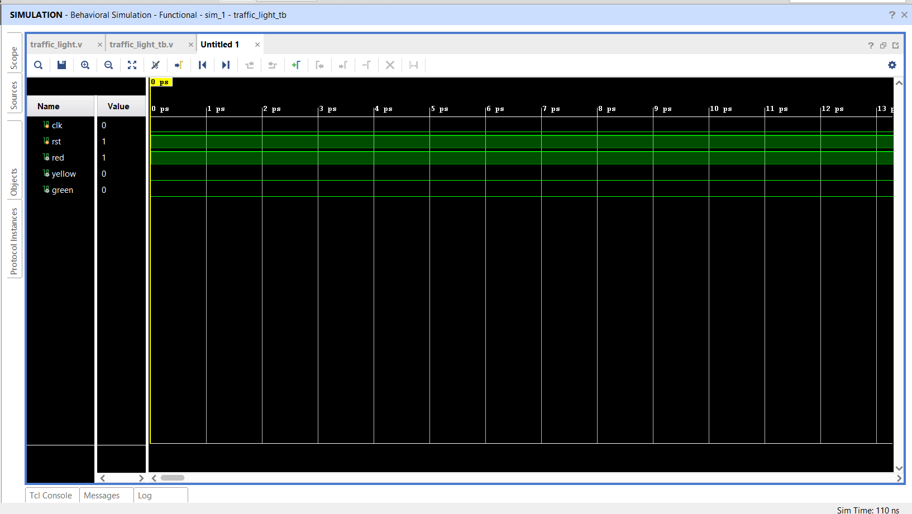

# 🚦 Traffic Light Controller — Verilog HDL


A fully functional **Traffic Light Controller** implemented in Verilog HDL using a **Finite State Machine (FSM)** design. Simulated and verified using Xilinx Vivado with a complete testbench.

---

## 📌 Project Overview

This project implements a 3-state traffic light controller using RTL design principles. The FSM cycles through **RED → GREEN → YELLOW → RED** states on every rising clock edge, with synchronous reset functionality.

---

## 🔧 Features

- ✅ 3-state FSM — RED, GREEN, YELLOW
- ✅ Synchronous active-high reset
- ✅ Clean RTL design with separate sequential & combinational logic
- ✅ Full testbench with `$monitor` for waveform verification
- ✅ Simulated on Xilinx Vivado

---

## 📁 Project Structure

```
Traffic-Light-Controller-Verilog/
│
├── traffic_light.v          # Main RTL design
├── traffic_light_tb.v       # Testbench
├── waveform.png             # Simulation waveform
├── rtl_schematic.png        # RTL Schematic
├── synthesis designfor traffic light.png  # Synthesis Design
└── README.md
```

---

## 💻 Source Code

### `traffic_light.v` — RTL Design

```verilog
module traffic_light(
    input clk,
    input rst,
    output reg red,
    output reg yellow,
    output reg green
);

parameter RED    = 2'b00;
parameter GREEN  = 2'b01;
parameter YELLOW = 2'b10;

reg [1:0] state;

// Sequential Logic — State Register
always @(posedge clk or posedge rst)
begin
    if(rst)
        state <= RED;
    else
    begin
        case(state)
            RED:     state <= GREEN;
            GREEN:   state <= YELLOW;
            YELLOW:  state <= RED;
            default: state <= RED;
        endcase
    end
end

// Combinational Logic — Output Logic
always @(*)
begin
    red    = 0;
    yellow = 0;
    green  = 0;
    case(state)
        RED:    red    = 1;
        GREEN:  green  = 1;
        YELLOW: yellow = 1;
    endcase
end

endmodule
```

---

### `traffic_light_tb.v` — Testbench

```verilog
`timescale 1ns/1ps

module traffic_light_tb;

reg clk;
reg rst;
wire red;
wire yellow;
wire green;

// Instantiate DUT
traffic_light DUT(
    .clk(clk),
    .rst(rst),
    .red(red),
    .yellow(yellow),
    .green(green)
);

// Clock generation — 10ns period
always #5 clk = ~clk;

initial
begin
    clk = 0;
    rst = 1;
    #10 rst = 0;
    #100;
    $finish;
end

initial
begin
    $monitor("Time=%0t  RED=%b  YELLOW=%b  GREEN=%b",
              $time, red, yellow, green);
end

endmodule
```

---

## 🔄 FSM State Diagram

```
        ┌─────────────────────────────────┐
        │                                 │
        ▼                                 │
    ┌───────┐   clk   ┌─────────┐   clk  │
    │  RED  │ ──────► │  GREEN  │        │
    └───────┘         └─────────┘        │
        ▲                  │             │
        │                  │ clk         │
        │             ┌────────┐         │
        └─────────────│ YELLOW │─────────┘
                      └────────┘
```

| State | RED | GREEN | YELLOW | Next State |
|-------|-----|-------|--------|------------|
| RED    | 1   | 0     | 0      | GREEN      |
| GREEN  | 0   | 1     | 0      | YELLOW     |
| YELLOW | 0   | 0     | 1      | RED        |

---

## 🖥️ Simulation Output

```
Time=0    RED=1  YELLOW=0  GREEN=0
Time=10   RED=0  YELLOW=0  GREEN=1
Time=20   RED=0  YELLOW=1  GREEN=0
Time=30   RED=1  YELLOW=0  GREEN=0
Time=40   RED=0  YELLOW=0  GREEN=1
...
```

### Waveform Screenshot
<!-- Add your simulation screenshot below -->


---

## 🚀 How to Run in Xilinx Vivado

1. **Open Vivado** → Create New Project
2. Add `traffic_light.v` as **Design Source**
3. Add `traffic_light_tb.v` as **Simulation Source**
4. Click **Run Simulation → Run Behavioral Simulation**
5. Observe waveforms for RED, GREEN, YELLOW signals

---

## 📚 Concepts Used

| Concept | Description |
|---|---|
| **FSM** | Finite State Machine with 3 states |
| **RTL Design** | Register Transfer Level design methodology |
| **Sequential Logic** | Clocked always block for state transitions |
| **Combinational Logic** | Always @(*) for output generation |
| **Testbench** | Self-checking simulation with $monitor |

---

## 👩‍💻 Author

**Prideeswari A**
B.E. Electronics Engineering — VLSI Design & Technology
M. Kumarasamy College of Engineering, Karur

[](https://github.com/PrideeswariA)
[](https://phenomenal-heliotrope-c53716.netlify.app)

---

## 📄 License

This project is open source and available under the [MIT License](LICENSE).
